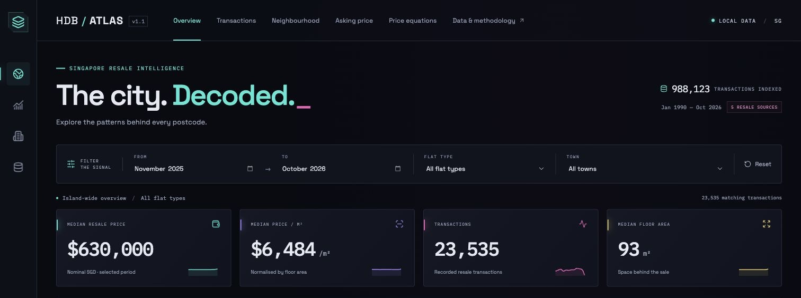
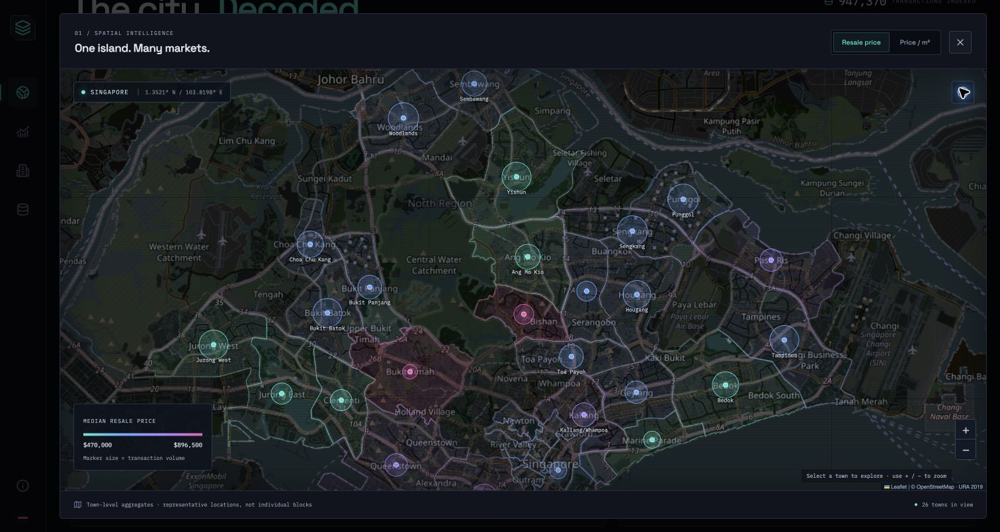
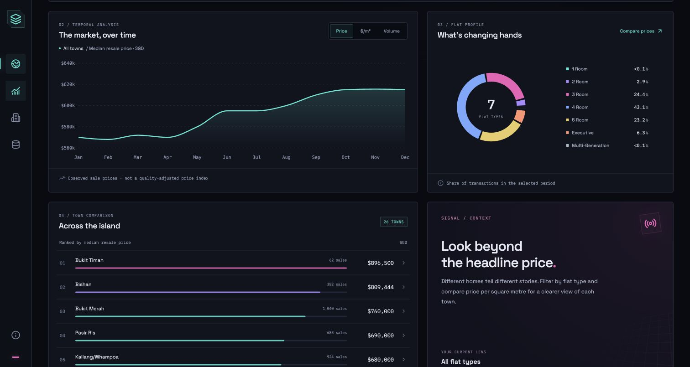
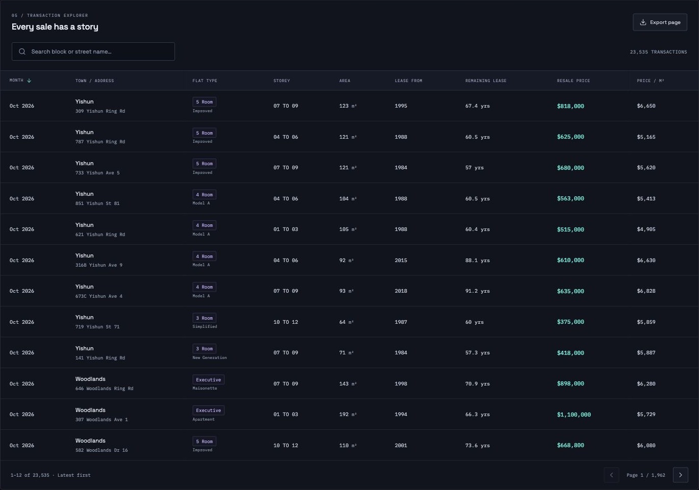

# HDB / ATLAS

A cyberpunk Singapore HDB resale dashboard with **988,123 transactions from January 1990 through October 2026**, 17 map overlays, 11 reference datasets and a derived secondary-school ranking. Compare estate price equations and assess an asking price against recent completed sales. The original CSVs are unchanged.

## Documentation

- **[Illustrated PDF guide](output/pdf/HDB-Atlas-Guide.pdf)** - archived v1.0 walkthrough; see the wiki for current data and features.
- **[Project wiki](docs/wiki/Home.md)** - linked guides for users and maintainers, including the API reference.
- [Full dashboard screenshot](docs/screenshots/full-dashboard.jpg).

## Screenshots

Actual captures of the running app, using **January-December 2024, all towns and all flat types**. These archived v1.0 screenshots show the earlier dataset ending in February 2025; the current app includes the October 2026 data and neighbourhood features.

### Dashboard overview



### Interactive town map



### Trends and comparisons



### Transaction explorer



## Run

Requires Node.js 20.19+ (or 22.12+) and Python 3.9+. The dashboard server uses the Python standard library. Generating price equations and running the full test suite additionally require NumPy (see below). No accounts, API keys or hosted database are required.

```sh
npm install
python3 -m pip install -r requirements-models.txt
npm run import
npm run model
npm run build
npm start
```

Open **http://127.0.0.1:8000**. The commands above prepare the database and price equations. Subsequent starts reuse them. Stop with Ctrl+C. For the dashboard without price equations, NumPy and the import/model commands can be omitted: the first start imports resale CSVs automatically if the database is absent. The asking-price assessment does not require NumPy or a model artifact.

If Python is not found, set `HDB_PYTHON` to its executable path. To use another port: `npm start -- --port 8001`.

For frontend development, keep `npm start` running in one terminal and run `npm run dev` in another; use the Vite URL printed in the terminal. API requests are proxied to port 8000.

## Explore

- Change the date range, flat type, or town. The initial view and Reset use the latest 12 months in the imported data (currently November 2025–October 2026). Explicit dates in shared URLs are preserved.
- Click a map marker or town ranking to filter the summary, trends, flat profile, and table. Map/rank comparisons keep all towns for the selected dates and flat type.
- Switch the map between median resale price and median price per square metre. Marker size represents transaction volume. Expand/reset the map or use its zoom controls.
- Switch the trend between price, price per m², and transaction volume. Zero-sale months remain on the timeline; their price medians are absent.
- Search transactions by block/street, page through matching rows, and export the current page as CSV.
- Copy the URL to preserve date, town, and flat-type filters. Table search and page are local to the current view.
- Choose a **Map overlay** for MRT exits, hawkers, community clubs, parks, cycling routes, school zones, subzones, car parks and other reference geography. Click features for their attributes. Large layers load only the visible area, up to 2,000 features; zoom in if the map reports a limit.
- Open **Neighbourhood** for a balanced secondary-school ranking (50% recorded station access, 25% subject listings, 25% CCA choices), an accessibility/price interpretation guide, and searchable schools (with subjects, CCAs and programmes), HDB building details, market stall counts, station-to-school travel, and annual transport/community statistics. These snapshots are independent of resale filters.
- Open **Asking price** and enter an estate, asking price in SGD, housing type and remaining lease in years. See whether the price looks high, whether at-asking or below-asking is better supported, an indicative comparison range, and supporting transactions. These inputs are independent of dashboard filters and are not saved in shared URLs.
- Open **Price equations** to compare the island model with an estate model, coefficient intervals, later-sale error and which recorded factors each model relies on. Small samples use the pooled island equation with an estate adjustment.
- Expand “Know your data” for methodology and exact source row counts.

## Asking-price assessment

Open [Asking price](http://127.0.0.1:8000/#asking) while the local server is running. Enter these four fields and select **Assess asking price**:

| Input | Example |
| --- | --- |
| Estate | Jurong East |
| Asking price (SGD) | 679999 |
| Housing type | 5 Room |
| Remaining lease (years) | 54 |

Using the current imported snapshot, this example finds **57 sales across 34 blocks**, with a median of **$648,000** and an indicative range of **$610,000–$685,000**. The asking price is within that range, so an at-asking sale is supported by the comparisons. Results change when the source data is refreshed.

The assessment uses the same estate and flat type, recorded remaining lease within five years of the input, and the 12 months before the latest source month. The latest month is excluded as potentially incomplete. At least **20 sales across three distinct blocks** are required; smaller samples receive no price verdict or range.

| Asking price | Assessment |
| --- | --- |
| Above the comparison range | Price looks high; below asking is better supported |
| Within the comparison range | At asking is supported by comparable prices |
| Below the comparison range | At asking is supported; investigate reasons for the lower price |

The range is the **25th–75th percentile of matching completed sale prices**, not a predicted sale-price interval. This is a transparent comparison rule, separate from the estate regression equations. All floor areas and storeys within the selected flat type are included; exact location, renovations, condition, views and accessibility are not controlled for. The app shows the sample's floor-area span and up to ten recent supporting records.

**The app does not estimate whether a home will sell, its time on market, or a probability of selling above/below asking.** Completed-sale records lack the matched asking-price histories and unsold listings needed to validate those predictions. A price within the range does not guarantee a sale, and a price outside it may be justified by unrecorded differences. Listing websites are not automatically scraped or monitored.

School rankings likewise describe supplied programme breadth and recorded station access, not academic performance, admissions prospects or a measured school-related price premium. See the [methodology](docs/wiki/Price-Equations.md) for the equations and asking-price comparison details.

## Data refresh and checks

Stop the server, update the source files, and run:

```sh
npm run import
npm run model
npm test
npm start
```

The import validates each row and atomically replaces `data/hdb.sqlite3` only when all files succeed. Errors identify the source file and row; the existing database remains intact. Only CSVs with the resale schema enter the transaction database. `ResaleflatpricesbasedonregistrationdatefromJan2017onwards.csv` supersedes `Resale flat prices based on registration date from Jan-2017 onwards.csv` when both exist. The original files stay unchanged. Other overlapping resale snapshots must still be removed from the input folder; duplicate-looking rows within the selected sources are intentionally preserved. Reference CSVs and GeoJSON files are loaded separately using the explicit registry in `backend/context.py`. Restart the server after every import to clear its in-memory response cache. The app defaults to the latest 12 available months. Reference sources retain their own dates and definitions.

Exact medians are calculated from individual transactions. Price per m² is computed per transaction before taking its median. The test suite covers import preservation and rollback, normalization, exact aggregates, filters, pagination, literal address search, reference data, school rankings, model validation and artifact freshness, plus asking-price classification, comparison windows, invalid inputs, sparse samples and supporting-record ordering. Run `npm test` for the full suite and `npm run build` to check the frontend build.

## Price equation setup

Generate the model artifact after importing transactions:

```sh
python3 -m pip install -r requirements-models.txt
npm run import
npm run model
```

Use the same interpreter as `HDB_PYTHON` if set. NumPy is only used for offline fitting and model tests; the server reads `data/price-models.json` without importing NumPy. Run `npm run model` after every resale import. Stale artifacts are rejected instead of silently showing equations for old data. All equations use a fixed recent window independent of the dashboard date/type filters. See [equation methodology](docs/wiki/Price-Equations.md) for formula definitions, validation and limitations.

## Map sources and limitations

Local map geometry is [URA Master Plan 2019 Planning Area Boundary (No Sea)](https://data.gov.sg/datasets/d_4765db0e87b9c86336792efe8a1f7a66/view), retrieved from data.gov.sg on 1 October 2026 and reused under the [Singapore Open Data Licence](https://data.gov.sg/open-data-licence). `public/data/planning-areas.geojson` is the official downloaded file. Geometry remains available offline.

The basemap uses [OpenStreetMap](https://www.openstreetmap.org/copyright) tiles with a dark visual filter; internet is required for those tiles and optional Google Fonts. Local data and planning-area geometry need no network after setup. The public OSM tile service is suitable for this local viewer; consult its [tile usage policy](https://operations.osmfoundation.org/policies/tiles/) before public deployment or substantial traffic.

Markers are area-weighted polygon centroids, not geocoded HDB blocks. Planning areas provide spatial context, not exact HDB town boundaries. Kallang represents the Kallang/Whampoa town aggregate; Downtown Core represents Central Area. Coordinates are not present in the original transaction CSVs.

Prices are nominal SGD, not inflation-adjusted or a valuation estimate. Changes can reflect the mix of homes sold. Approval dates are used through February 2012 and registration dates from March 2012. Remaining lease is shown only when supplied. October 2026 may be incomplete. There is no automatic live-data refresh.

## Project layout

- `backend/data.py`: CSV validation/import and exact aggregate queries.
- `backend/asking.py`: comparable-sale selection, asking-price classification and percentile ranges.
- `src/AskingPrice.jsx`: four-input asking-price form, results and supporting sales.
- `backend/insights.py`: balanced school ranking and source-match safeguards.
- `backend/price_models.py`: offline national and estate regressions, chronological validation and artifact freshness checks.
- `src/PriceEquations.jsx`: interactive equations, estate comparisons and model audit.
- `backend/context.py`: reference source registry, school enrichment, paginated search and bounded geographic queries.
- `backend/server.py`: read-only API and production asset server, bound to localhost.
- `src/`: React dashboard, Leaflet map, Recharts charts, transaction explorer, responsive styles.
- `public/data/`: locally bundled official map geometry.
- `tests/`: deterministic data tests using temporary fixtures.
- `docs/wiki/`: user guide, methodology, architecture/API and maintenance wiki.
- `docs/screenshots/`: browser screenshots embedded above.
- `output/pdf/HDB-Atlas-Guide.pdf`: illustrated project guide.
- `scripts/build_guide.py`: reproducible PDF builder (documentation-only dependencies: reportlab and Pillow).
- `scripts/python.mjs`: finds a working Python 3 interpreter across local environments.

The Python standard-library server is intended for local use. Hosting, authentication, and block-level geocoding are outside this version.

## License

Copyright © 2026 **Randhir Prem (randhirprem)**. Original project code and documentation are licensed under the [MIT License](LICENSE).

Third-party datasets, map geometry, map tiles, fonts and dependencies retain their respective licences and attribution requirements; inclusion in this repository does not make them MIT-licensed. The bundled URA planning-area geometry uses the Singapore Open Data Licence linked above, and OpenStreetMap attribution and tile-service terms also apply. Consult each source provider’s terms before redistributing additional supplied reference files. The app’s source registry identifies those files but does not grant rights to them.
