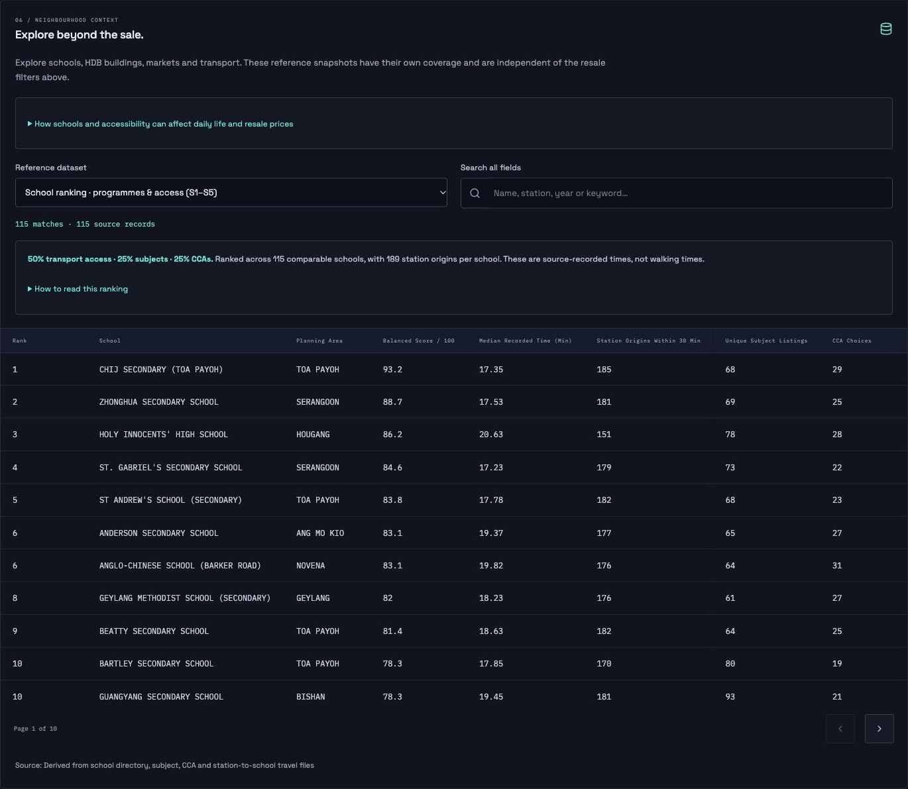
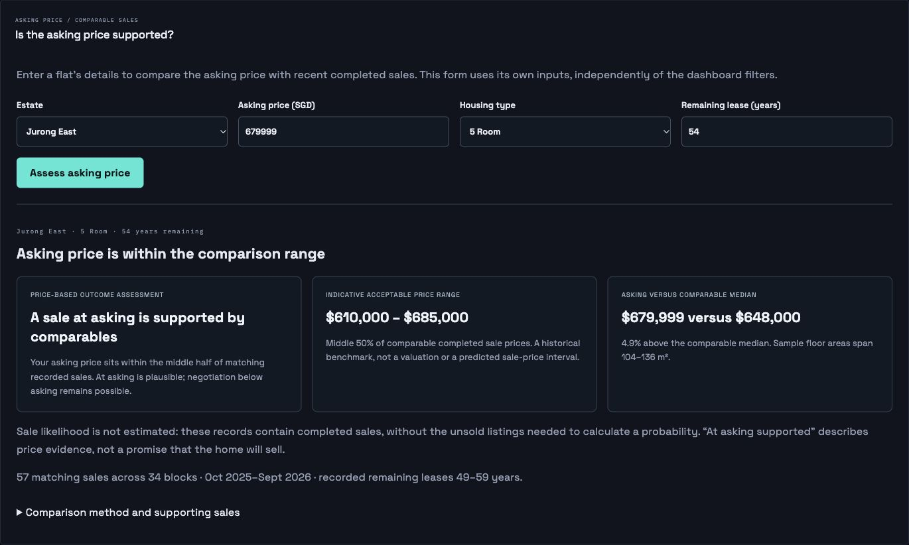
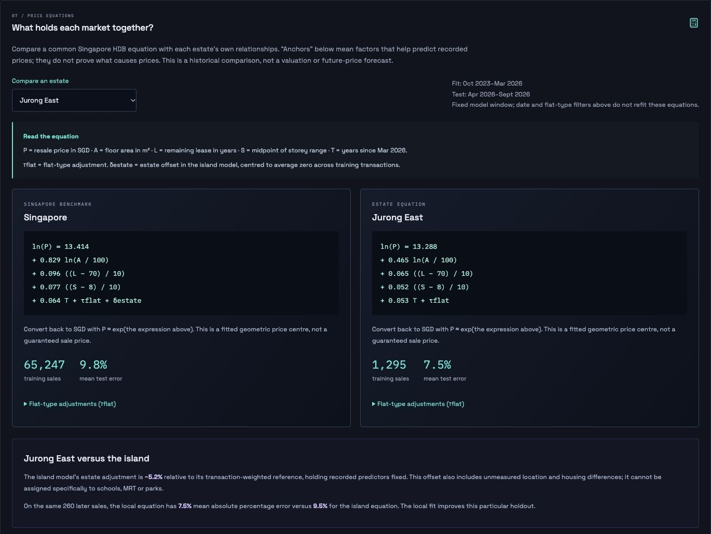

# Dashboard guide

[Wiki home](Home.md) · [Data and methodology](Data-and-Methodology.md)

Screenshots were refreshed on 8 October 2026. The dashboard captures use November 2025–October 2026, all towns and flat types; the asking-price and estate-equation examples use Jurong East.

## 1. Choose a comparison

Use From and To to set an inclusive month range. Pick a flat type for a more comparable group of homes, then optionally select a town. Reset restores the latest 12 available months, all towns and all flat types. Copy the browser URL to preserve these shared filters.

The four summary cards show median resale price, median price per square metre, transaction count and median floor area. Currency is SGD. Missing medians display as a dash, not a zero price.

## 2. Read the map

Click a town marker to update the summary cards, trend, flat profile and transaction table. Click its selected-town badge to clear the town filter. Map and ranking comparisons remain island-wide for the chosen dates and flat type.

- Colour represents median resale price or price per square metre, depending on the selected map mode. The legend rescales to the current comparison.
- Marker size represents transaction count. Hover for the town name, median and sample size.
- Use the zoom buttons, reset-view button or expanded map. Press Escape to close the expanded view.
- Markers represent towns using planning-area centroids, not individual blocks. The planning polygons are spatial context, not exact HDB town boundaries.

## 3. Explore time and flat profiles

The trend offers Price, $/m² and Volume modes. Monthly medians are based on that month's transactions. Months without sales have zero volume and no price median, so gaps are not hidden. A completely empty selection shows an empty state.

The flat profile starts with each flat type's share of matching transactions. Compare prices changes it to median price by flat type. The town ranking uses the map's selected price measure; expand it to see all matching towns. A high town median can reflect larger or newer homes, not just location.

## 4. Inspect and export records

Search block or street names in the transaction explorer. This search affects the table only, while shared filters apply to both the table and dashboard. Results are sorted by month descending, then source import ID, with 12 rows per page. Order within a month does not imply a known day of sale.

Export page downloads only the current page as CSV. Its 13 columns include the original source filename. Page and search are not saved in the shared URL. Changing shared filters resets the table; changing search returns to page 1.

## Worked example

For January-December 2024, select **4 ROOM** and **BEDOK**. The local dataset contains **452 transactions**, a **$540,000** median resale price and **92 m²** median area. Selecting **TAMPINES** on the map changes that selection to **867 transactions** and a **$625,000** median resale price. These are historical observations, not current asking prices.

## 5. Explore neighbourhood context

Choose a Map overlay above the map, then click features to inspect source attributes. Only one overlay is displayed at a time. Pan and zoom to reload features for the visible area; a limit notice means you should zoom in to see more. Select Resale markets only to clear the overlay.

The Neighbourhood panel offers 11 source datasets plus a derived balanced secondary-school ranking. It opens on the ranking, with the scoring method and exclusions available above the table. Expand the accessibility guide for daily-life considerations and price-interpretation limits. Search by school, subject, CCA, block, street, station or year. Open school cards for linked programmes, or building cards for flat counts and facilities. Other datasets appear in horizontally scrollable tables. Search and pagination apply only to the selected reference dataset; switching datasets resets both.

Reference snapshots do not follow the resale filters and should not be interpreted as historical amenities for a selected resale month. Travel figures are not live estimates, and school road zones are not admission boundaries.

## 6. Assess an asking price

Open **Asking price**, select estate and housing type, enter the asking price in SGD and remaining lease in years, then select **Assess asking price**. The result flags high prices, explains whether at-asking or below-asking is better supported, and shows an indicative range and supporting sales. Inputs are independent of dashboard filters; editing one clears the previous result.

The range is the middle half of comparable recorded prices, not a predicted sale-price interval. A minimum of 20 sales across three blocks is required. The app does not estimate the probability that a property sells. See [Asking-price assessment](Asking-Price.md) for worked examples and the full method.

## 7. Compare price equations

Open Price equations or select an estate in its dropdown. The estate selection is shared with the main dashboard; date and flat-type filters do not refit the models. Compare the numeric formulas, conditional associations with block-clustered coefficient intervals, and errors on the same later sales. Expand All estate comparisons for the full audit.

Factor-removal bars show the change in held-out mean absolute percentage error when a factor is omitted and the model refitted. They are not percentages of the home’s price. Negative bars mean removing that factor improved the test result. Small samples use the island model with an estate offset, explicitly labelled pooled.
